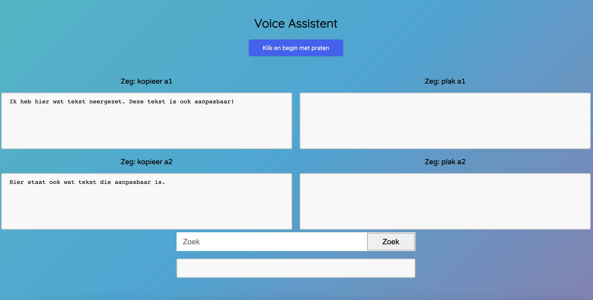

# Voice assistent

### Concept

Deze website is gemaakt voor 1 specifiek iemand. Eric is een man met een beperking. Hij zit in een rolstoel en kan zijn armen niet helemaal goed bewegen, wel heeft hij de volledige controle over zijn spieren. Zelf is hij werkzaam bij de toegangelijkheid van de gemeente Amsterdam.

User story:

> Eric wil graag met zijn stem basishandelingen kunnen uitvoeren binnen documenten, zoals copy/paste. Hier is het de taak om uit te zoeken welke handelingen hij nog meer vaak gebruikt, en hoe je die op een voor Eric zo prettig mogelijke manier kunt laten werken.

### Resultaat

Bekijk de applicatie [hier](https://fabian-vis.github.io/human-centered-design-2122/)

### User Scenario

Hier ga ik wat dieper in wie Eric is en wat hij uiteindelijk wil bereiken.

#### Wie is Eric?

Eric heeft een beperking. Hij kan zijn armen niet helemaal goed bewegen. Wel heeft hij volledige controle over zijn spieren. In het dagelijks leven zet hij zich in voor de toegangelijkheid van de gemeente Amsterdam. Denk hierbij aan de opstapjes voor rolstoelen bij stoepen of bij perrons voor de tram. Hij houdt van spelletjes, lezen, films en muziek.

#### Wat wil Eric bereiken?

Hij wil doormiddel van voice text kunnen kopieren, plakken en selecteren.

#### Hoe kan Eric dit bereiken?

Ik heb voice commandos ingebouwd die hij kan opnoemen waardoor hij bijvoorbeeld een text kan kopieren.

#### Waarom wil Eric mijn site gebruiken?

Mijn applicatie is gebouwd om Eric het leven een stuk gemakkelijker te maken.

## Testen

### Week 1

De eerste dag stond in het teken van onderzoek doen naar hoe ik doormiddel van voice control kan zorgen dat er iets geknipt en geplakt wordt. Ik heb een klein websitetje opgezet waarmee je kon knippen en plakken doormiddel van voice. Hierna was het wachten op de feedback van Eric en Eric zelf beter te leren kennen. Ik heb geen specifieke vragen opgesteld voor deze week omdat ik Eric op een algemene manier beter wilde leren kennen.

#### Algemene informatie Eric donderdag 21 April

- Houdt van lezen, films, games en muziek
- Kan arm niet helemaal goed bewegen
- Heeft wel volledige controle over spieren
- Is niet spastisch en kan een telefoon prima bedienen
- Werkt bij de toegangelijkheid van de gemeente van Amsterdam
- Eigenlijk is de knip en plak opdracht voor een kennis van Eric
- Deze kennis heeft nog minder kracht in haar spieren
- Scrollen met twee vingers is lastig
- Heeft een microsoft surface pro laptop
- Gebruikt microsoft edge als browser maar soms ook in Google Chrome

#### Feedback prototype donderdag 21 April

- Selecteren is wel een dingetje, is een beetje moeilijk uit te voeren
- Misschien de mogelijkheid om helemaal geen knop te hebben en dat de applicatie per sessie luistert naar wat er gezegd word
- Geef als feedback dat de applicatie aan het luisteren is
- Zoeken en selecteren zouden goede features kunnen zijn
- Gebruikt vaak excel spreadsheet waar hij vaak dezelfde dingen meerdere keren wil kunnen kopieren op andere plekken
- Zou graag bepaalde types data snel willen kunnen aanpassen

### Week 2

Wat ik nu wil gaan maken is dat Eric doormiddel van praten een gedeelte kan highlighten van text zodat deze makkelijk aanpasbaar is. Ik heb hier een hele middag aan besteed maar het is mij niet gelukt om dit te maken. Wat ik wel gemaakt heb is een plek waar tekst geplakt kan worden en dan kan Eric zoeken op een specifiek iets (door te typen of Voice gebruiken)en dit highlighten.

#### Wat wil ik weten van Eric

- Wat vind hij het design.
- Wat vind hij van de feature van het highlighten.
- Wat vind hij van de interface.
- Wat zou hij nog verder willen toevoegen.

#### Algemene informatie Eric week 2

- Legt zijn hand op de muis in een vuist vorm en leunt naar links of rechts om de muis te bedienen
- Bedienen gaat vlot en gemakkelijk waarschijnlijk door jaren gebruik
- De persoon waarvoor het eigenlijk is kan niet heel goed een muis bedienen dus misschien is tabben een betere optie
- Plakken op specifieke plekken is een groot pijnpunt voor diegene
- Houdt van Dungeons and Dragons (!)

#### Observatie van andere prototypes week 2

- voice command: Een woord zeggen en dan meteen naar dat betreffende woord springen op de pagina.
- Feedback krijgen van wat je gezegd heb is erg belangrijk
- Feedback van de knop krijgen als hij record. Bijvoorbeeld rood als die niet record en groen als die aanstaat
- Feedback krijgen als er iets gekopieerd of geplakt is

#### Feedback eigen prototype week 2

Eric vond het specifiek highlighten van een woord in een grote lap text erg handig. Misschien nog even kijken naar layout dat de buttons niet te ver uit elkaar staan. Ook andere algemene feedback dingetjes zoals button feedback enzovoort.

#### Week 2 resultaat:

### Week 3

Ik ga het meer voor Eric maken. Ik had vernomen dat hij van Dungeons and dragons houd dus ga ik proberen een beetje die style aan te houden. Ook ga ik de feedback wat beter maken zoals bij de button en ik ga wat aan de layout veranderen. Verder denk ik niet dat ik qua technische dingen nog wat ga implementeren. Simpel weg omdat ik daar niet aan toe ga komen en het te hoog gegrepen is voor mij.

#### Wat wil ik weten van Eric

- Wat vind hij het design
- Is dit fijn te bedienen
- Is er voldoende feedback

#### Feedback eigen prototype week 3 

Design was leuk. Grappig poppetje toegevoegd. Functionaliteit van het selecteren vond Eric oprecht handig dus dat was top. Alleen was de volgorde niet helemaal duidelijk. Ik had het kopieer gedeelte eigenlijk boven het zoek gedeelte moeten zetten omdat dat iets is wat eerder gedaan moet worden. Ik kwam hierachter door Eric eerst zelf door de applicatie heen te laten gaan om te kijken of die het begreep en het was duidelijk dat hij dacht dat hij eerst iets moest zoeken.

### Design Principes

Hieronder ga ik per principe uitleggen hoe ik deze heb toegepast op mijn eigen project. Per principe leg ik uit waar ik op gelet heb en hoe ik deze heb toegepast.

#### Study Situation

Ik ben Eric door de weken gaan observeren en vragen gesteld om er achter te komen hoe hij zelf het liefst een computer bediend. We kwamen er echter al snel achter dat deze opdracht eigenlijk niet persee bedoeld was voor Eric zelf maar voor een kennis van hem die een ergere vorm van een spierziekte heeft dan Eric. Voor de opdracht probeer ik een beetje rekening te houden met beide. Dit omdat we de kennis van Eric nooit in het echt hebben kunnen ontmoeten en haar vragen hebben kunnen stellen.

- Eric kan zijn arm niet helemaal goed bewegen. Wel heeft hij volledige controle over zijn spieren. Ook is hij niet spastisch en kan hij een telefoon prima bedienen. Wat hij wel lastig vind is scrollen met twee vingers.

- Eric bediend een muis doormiddel van

- De persoon waarvoor het is kan niet goed een muis bedienen. Ze kan het wel maar liever niet. Daarom is het een goed idee om zoveel mogelijk met voice te doen en de handelingen die met muis moeten zo dicht mogelijk bij elkaar te zetten.

- We kwamen er al snel achter dat de opdracht niet alleen ging over knippen en plakken. Eric wilde graag ook dat het selecteren van specifieke woorden een feature werd binnen de applicatie

##### Toepassing

Doordat het voor Eric en voor die kennis aardig lastig is om een website goed te navigeren met muis heb ik de focus voornamelijk gelegd op Voice. Wegens privacy heb ik ervoor gekozen om niet de microfoon altijd aan te houden. Hierdoor moet je nog wel op een knop drukken om de microfoon aan te zetten maar Eric zei dat dit niet echt een probleem is. Wel heb ik ervoor gezorgd dat de knoppen dichtbij elkaar staan. Dit gaf Eric ook als feedback omdat het dan een stuk makkelijker is om de website te bedienen.

Het selecteren van een specifiek word is mij helaas niet gelukt. Wel heb ik een feature toegevoegd die een specifiek woord wat gezegd is highlight binnen een geplakte tekst. Eric gaf zelf aan dat dit een fijne feature is dus daar ben ik erg blij mee.

#### Ignore Conventions

Ik heb hierbij gekeken naar de standaard manier van iets kopieren en plakken. Normaal gesproken selecteer je een stukje tekst, kopieer je deze met je toetsenbord of muis, navigeer je naar de plek waar je deze tekst wil plakken en gebruik je weer je toetsenbord of muis om de tekst te plakken. Dit kan helaas niet gebruikt worden omdat een muis niet goed bedienbaar is voor Eric.

##### Toepassing

Dus alles moet over het algemeen met voice worden bediend. Hierdoor verwaarloos ik de normale "conventions".

#### Prioritise Identity

Hier heb ik voornamelijk gekeken naar hoe ik het zo specifiek mogelijk voor Eric kan maken.

- Eric houd van spelletje, muziek, films en lezen
- Dungeons and Dragons is een spel wat hij veel speelt
- Heeft een microsoft surface pro laptop
- Gebruikt microsoft edge als browser maar soms ook in Google Chrome

##### Toepassing

Het leek mij een goed idee om de website een persoonlijke twist te geven. Ik heb ervoor gekozen om een soort fantasty dungeon style te gebruiken. Dit omdat Eric aangaf dat hij hield van spelletjes, films en dungeons and dragons.

#### Add Nonsense

Hier gaat het over het toevoegen van onnozele dingen.

#### Toepassing

Ik heb een kleine goblin onderin het scherm toegevoegd die infinite rondjes rent in en uit het scherm. Als er dan op de microfoon knop word gedrukt stopt hij en gaat hij als het waren luisteren naar wat er gezegd word.

### Conclusie

Ik hoop dat Eric wat heeft aan mijn applicatie. Ik heb veel nieuwe skills geleerd. Voordat ik begon aan dit vak heb ik eigenlijk al deze tijd een applicatie gemaakt voor "gebruikers". Vaak wist je wel ongeveer wat ze wilde maar had je vaak zelf ook nog heel veel in breng en te zeggen. Nu moest ik voor 1 iemand iets maken. Dit werkte toch echt wel een stuk anders. Ik merkte dat naarmate ik meerdere keren testte met Eric ik er achter kwam wat hij ECHT wilde en wat zijn hobby's waren.

Ik merkte ook bij de eerste keer testen dat ik soms nog een beetje teveel voor zei en niet echt goed testte. Met dit ingedachte had ik de tweede test afgelegd en merkte ik dat ik uit deze test een stuk meer interessante dingen haalde. Ik heb dus geleerd dat ik niet zoveel moet voorzeggen en de gebruiker hard op moet zijn/haar gedachte gang moet laten uitspreken.

Als ik wat meer tijd had wilde ik mij graag nog verdiepen in de voice commando's. Ik wilde bijvoorbeeld nog toevoegen dat er doormiddel van voice een bepaald woord geselecteerd kon worden.

Al met al ben ik wel trots op wat ik na deze 3 weken geleerd en opgeleverd heb.
